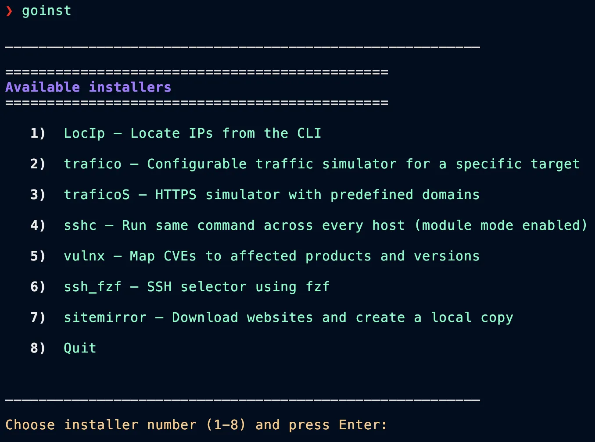

# binarios-go

`binarios-go` is a collection of small Go command-line tools and prebuilt binaries for networking, reconnaissance, SSH workflows, traffic simulation, local lab work, and security testing.

The repository is organized as a set of independent tools. Most source directories have their own `go.mod`, dependencies, and build flow, while the `binarios-go/` directory contains ready-to-use compiled binaries.

## Install Binaries Without Cloning

The `goinst` installer script provides an interactive menu that can install selected binaries directly. You can use it to get the tools without cloning this repository or building every project from source.



The installer menu includes:

| Option | Tool | Purpose |
|---:|---|---|
| 1 | `LocIp` | Locate IP addresses from the CLI. |
| 2 | `trafico` | Generate configurable traffic for a specific target. |
| 3 | `traficoS` | Run an HTTPS traffic simulator with predefined domains. |
| 4 | `sshc` | Run the same command across every host in your SSH config. |
| 5 | `vulnx` | Map CVEs to affected products and versions. |
| 6 | `ssh_fzf` | Select SSH hosts interactively with `fzf`. |
| 7 | `sitemirror` | Download websites and create a local copy. |

Run `goinst`, choose the installer number, and press Enter. After installation, make sure the target binary directory is available in your `PATH`.

`lanwatchgo` can also be downloaded directly for macOS Apple Silicon:

[Download lanwatchgo](https://raw.githubusercontent.com/4rji/binarios-go/main/binarios-go/lanwatchgo)

## Install With Go

Some tools can also be installed directly with `go install`:

```bash
go install github.com/4rji/binarios-go/sshc@latest
go install github.com/4rji/binarios-go/ssh_fzf@latest
go install github.com/4rji/binarios-go/sitemirror@latest
go install github.com/4rji/binarios-go/trafico/cmd/trafico@latest
go install github.com/4rji/binarios-go/trafico/cmd/traficoS@latest
```

Go installs binaries into `GOBIN`, or `$(go env GOPATH)/bin` when `GOBIN` is not set.

## Repository Layout

- `binarios-go/` - prebuilt binaries for supported tools and platforms.
- `trafico/` - configurable HTTP/HTTPS traffic simulators.
- `sshc/` - concurrent command runner for hosts in `~/.ssh/config`.
- `ssh_fzf/` - interactive SSH selector powered by `fzf`.
- `sitemirror/` - website mirroring utility for local copies.
- `honeypot/`, `tun2socks/`, `sandfly-processdecloak/`, `ezuri/` - forked or vendored projects kept close to their upstream layout.
- Other top-level directories - independent tools, experiments, and lab utilities.

## Build From Source

This is not a single Go workspace. Do not run `go build ./...` or `go test ./...` from the repository root expecting every tool to build together.

Build a specific tool from its own directory:

```bash
cd sshc
go build ./...
go test ./...
```

For tools with a `cmd/` layout:

```bash
cd trafico
go build ./cmd/trafico
go build ./cmd/traficoS
```

Some projects provide a Makefile with custom targets. In those directories, prefer the documented Makefile workflow.

## Intended Use

These tools are meant for authorized administration, lab environments, network diagnostics, and security research. Use them only on systems and networks where you have permission.

## License

Licensing can vary by subproject, especially for forked upstream tools. Check the relevant tool directory for its license and security files.
